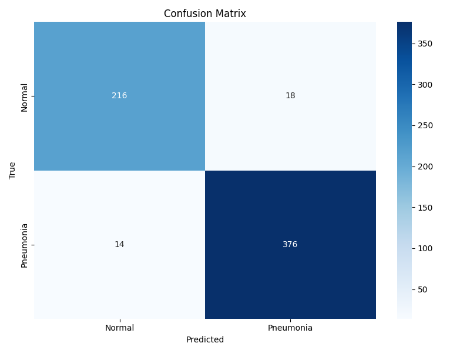
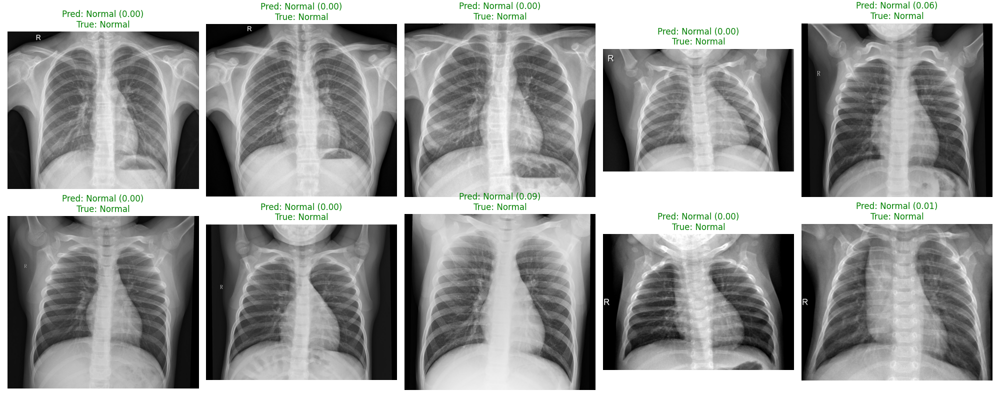
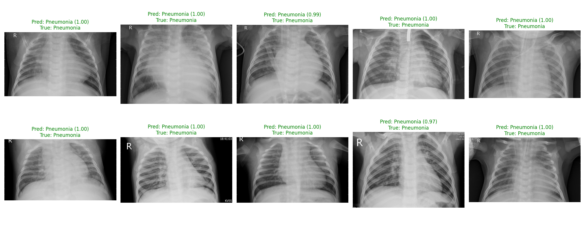

# Pneumonia Detection from Chest X-rays

Binary chest X-ray classification (Normal vs Pneumonia) using ConvNeXt V2 with transfer learning, strong augmentation, mixed precision training, and validation-selected thresholding.

## Overview

- **Task:** Binary classification on pediatric chest X-rays
- **Backbone:** `convnextv2_base.fcmae_ft_in22k_in1k` (timm)
- **Loss:** Combined focal + label-smoothed BCE
- **Optimization:** AdamW + OneCycleLR + gradient clipping + optional SWA
- **Evaluation protocol:** Threshold selected on validation only, then frozen for holdout test

Dataset: [Kaggle Chest X-Ray Pneumonia](https://www.kaggle.com/paultimothymooney/chest-xray-pneumonia)

## Final Results (Holdout Test)

Run command:

```bash
python train.py --data_dir .\dataset --output_dir .\output --checkpoint_dir .\checkpoints
```

Test set size: **624** (Normal: 234, Pneumonia: 390)

| Metric                           |      Value |
| -------------------------------- | ---------: |
| Accuracy                         | **0.9391** |
| ROC-AUC                          | **0.9735** |
| F1 (Pneumonia, threshold = 0.49) | **0.9525** |

| Class     | Precision | Recall | F1-score | Support |
| --------- | --------: | -----: | -------: | ------: |
| Normal    |      0.96 |   0.88 |     0.92 |     234 |
| Pneumonia |      0.93 |   0.98 |     0.95 |     390 |

## Figures

### Training Dynamics


### Test ROC (Holdout)


### Confusion Matrix



### Sample Predictions

**Normal (correct predictions)**



**Pneumonia (correct predictions)**



## Reproducibility

```bash
# 1) Install dependencies
pip install -r requirements.txt

# 2) Train + evaluate
python train.py --data_dir .\dataset --output_dir .\output --checkpoint_dir .\checkpoints

# 3) Optional: standalone prediction report/visuals
python predict.py --model_path output\pneumonia_model_<timestamp>_weights_only.pth --data_dir dataset\test --output_dir predictions --threshold_file output\threshold_<timestamp>.json --use_tta
```

Primary artifacts:

- `checkpoints/best_model.pth`
- `output/pneumonia_model_<timestamp>_weights_only.pth`
- `output/threshold_<timestamp>.json`
- `output/training_summary_<timestamp>.txt`
